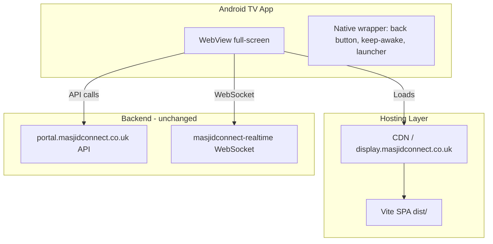

# Android TV Display App — Research & Implementation Plan

## Executive Summary

The MasjidConnect display app is **~95% portable**: all core logic runs in the browser (React SPA, Redux, API, WebSocket). Only a few features depend on the Raspberry Pi OS. An Android TV version can achieve **near-full feature parity** with minimal changes to the existing codebase.

---

## 1. Feature Breakdown: What Can Be Included

### Full parity (no changes needed)

| Feature                      | Notes                                                                                          |
| ---------------------------- | ---------------------------------------------------------------------------------------------- |
| **Prayer times**             | Adhan/Jamaat grid, active/next highlighting                                                    |
| **Countdown to next prayer** | Real-time countdown                                                                            |
| **Content carousel**         | Announcements, events, Islamic content, Asma al Husna                                          |
| **Header**                   | Masjid name, date, connection status                                                           |
| **Footer**                   | Branding, version                                                                              |
| **Prayer-phase behaviour**   | Countdown-adhan, countdown-jamaat, jamaat-soon (phones-off), in-prayer                         |
| **Ramadan mode**             | Green/gold theme, Hijri date, Iftar/Suhoor countdown                                           |
| **Emergency alerts**         | Full-screen overlay, all colour schemes, auto-expiry                                           |
| **Pairing flow**             | QR code + polling — user scans from phone; TV is display-only                                  |
| **Offline-first**            | LocalForage, Redux Persist, cached fallbacks                                                   |
| **Real-time sync**           | WebSocket (Socket.io), heartbeat, content updates                                              |
| **Remote commands**          | RELOAD_CONTENT, RESTART_APP, CLEAR_CACHE, REFRESH_PRAYER_TIMES, UPDATE_SETTINGS, FACTORY_RESET |
| **Orientation**              | Landscape/portrait via backend setting (CSS rotation)                                          |
| **PWA caching**              | Service worker, Workbox strategies                                                             |

### Partial parity (minor adaptations)

| Feature                     | Pi behaviour                                                                | Android TV adaptation                                                                                              |
| --------------------------- | --------------------------------------------------------------------------- | ------------------------------------------------------------------------------------------------------------------ |
| **FORCE_UPDATE**            | Triggers `update-from-github.sh` via `POST /internal/trigger-update`        | No local update script. Treat as `RELOAD_CONTENT` (refresh page). Admin can push updates via Play Store.           |
| **WiFi recovery hotspot**   | Footer shows "Connect to MasjidConnect-Setup" when offline; Pi runs hotspot | Android TV has no hotspot. Footer shows generic "No connection" message; user configures WiFi in Android Settings. |
| **Update status in footer** | Polls `/internal/update-status`                                             | Skip polling; show connection status only.                                                                         |

### Not available on Android TV

| Feature                     | Reason                                                               |
| --------------------------- | -------------------------------------------------------------------- |
| **REBOOT_DEVICE**           | Requires root/OS access; already logged as unsupported on Pi.        |
| **On-device WiFi setup UI** | Pi runs `wifi-setup-server.mjs`; Android TV uses system Settings.    |
| **Self-update from GitHub** | Pi runs `update-from-github.sh`; Android TV uses Play Store updates. |

---

## 2. Implementation Approaches

### Approach A: WebView wrapper (recommended)

**What:** A minimal native Android TV app that loads the existing React SPA in a full-screen WebView.

**Pros:**

- **Zero React changes** for core features; only platform-detection and conditional logic for Pi-specific endpoints
- **100% feature parity** for display logic
- **Single codebase** — one build, one deployment pipeline
- **Fast to ship** — thin Kotlin/Java wrapper (~500–1000 LOC)
- **Updates** — host the app at a URL; WebView loads it; updates deploy without Play Store (or use Play Store for wrapper updates)

**Cons:**

- WebView performance can vary by device (less critical for display-only, low-interaction app)
- Requires hosting the built SPA at a public URL (e.g. `https://display.masjidconnect.co.uk`)

**Effort:** Low. Prerequisite: host the production build.

---

### Approach B: React Native for TV

**What:** Rewrite or adapt the app using React Native with Android TV support (e.g. `react-native-tv` or community forks).

**Pros:**

- Native performance, better for complex animations
- Amazon uses React Native for Fire TV (Vega framework)

**Cons:**

- **Full rewrite** — different component model, styling, navigation
- No Tailwind; different state patterns
- Higher effort and ongoing maintenance for two codebases (web + RN)

**Effort:** High. Not recommended unless long-term strategy is RN-first.

---

### Approach C: Native Kotlin (Jetpack Compose for TV)

**What:** Full native rewrite using Kotlin and Jetpack Compose for TV.

**Pros:**

- Best performance, deepest system integration
- Leanback library for TV-specific UX

**Cons:**

- **Complete rewrite** — all UI, logic, API integration
- Two separate codebases to maintain

**Effort:** Very high. Only justified if WebView proves insufficient.

---

## 3. Recommended Path: WebView Wrapper

### Prerequisites

1. **Host the SPA** — Deploy `dist/` to a CDN or subdomain (e.g. `https://display.masjidconnect.co.uk`). CI can build and deploy on release.
2. **Platform detection** — Add a simple check (e.g. `userAgent`, URL param, or injected config) so the app knows it is running in Android TV WebView vs Pi Chromium.

### Native wrapper responsibilities

| Responsibility          | Implementation                                           |
| ----------------------- | -------------------------------------------------------- |
| Load URL                | `WebView.loadUrl("https://display.masjidconnect.co.uk")` |
| Full-screen             | `SYSTEM_UI_FLAG_`* to hide nav/status bars               |
| Keep screen on          | `FLAG_KEEP_SCREEN_ON`                                    |
| Back button             | Finish activity (return to Android TV home)              |
| Launcher assets         | 320×180 banner, 160×160 icon                             |
| Optional: prevent sleep | `PowerManager.WakeLock` if needed                        |

### React app adaptations

| File                                                                         | Change                                                                                                        |
| ---------------------------------------------------------------------------- | ------------------------------------------------------------------------------------------------------------- |
| [src/services/remoteControlService.ts](src/services/remoteControlService.ts) | Detect platform; on Android TV, treat `FORCE_UPDATE` as `RELOAD_CONTENT` (no `/internal/trigger-update` call) |
| [src/components/display/Footer.tsx](src/components/display/Footer.tsx)       | Skip `/internal/wifi-recovery-status` poll on Android TV; skip update-status polling                          |
| New: `src/config/platform.ts`                                                | Export `isAndroidTV` (from `navigator.userAgent` or injected `window.__PLATFORM__`)                           |

---

## 4. Android TV Store Requirements

| Requirement          | Action                                                                                                                             |
| -------------------- | ---------------------------------------------------------------------------------------------------------------------------------- |
| Opt-in to Android TV | Play Console → Form Factors                                                                                                        |
| Screenshots          | 320×180 banner, 1280×720 (or 1920×1080) screenshots                                                                                |
| Landscape only       | App already supports landscape                                                                                                     |
| D-pad navigation     | Display-only app — no focusable elements; back button exits to home. Quality guidelines allow exceptions for non-interactive apps. |
| Back button          | Must return to Android TV launcher                                                                                                 |
| Target API           | Android 14 (API 34) minimum; 64-bit from Aug 2026                                                                                  |
| Review               | ~2 weeks typical                                                                                                                   |

---

## 5. Execution Plan

### Phase 1: Hosting and platform detection (1–2 weeks)

1. Set up hosting for the production build (e.g. Cloudflare Pages, Vercel, or subdomain on existing infra).
2. Add `VITE_APP_URL` (or similar) to environment config for the canonical display URL.
3. Add `src/config/platform.ts` with `isAndroidTV` detection.
4. Update `remoteControlService` and `Footer` to skip Pi-specific endpoints when `isAndroidTV`.

### Phase 2: Native WebView app (2–3 weeks)

1. Create new Android project with `minSdk` 21+, `targetSdk` 34.
2. Add `android:isGame="false"`, `android:required="false"` for `android.hardware.touchscreen` (TV has no touch).
3. Implement `MainActivity` with WebView, full-screen flags, keep-awake, back-button handling.
4. Add TV banner (320×180) and icon (160×160).
5. Test on Android TV emulator and physical device.

### Phase 3: CI/CD and Play Store (1–2 weeks)

1. Add Android build to GitHub Actions (or similar).
2. Create Play Console listing, upload APK/AAB.
3. Submit for review.

### Phase 4: Documentation and rollout

1. Document Android TV setup (install from Play Store, pair via QR).
2. Add to README and user guides.

---

## 6. Effort Summary

| Approach            | Effort    | Time to first release | Maintenance                 |
| ------------------- | --------- | --------------------- | --------------------------- |
| **WebView wrapper** | Low       | 4–7 weeks             | Low — React changes minimal |
| React Native        | High      | 3–6 months            | High — two codebases        |
| Native Kotlin       | Very high | 6+ months             | High — two codebases        |

---

## 7. Key Files to Modify

- [src/services/remoteControlService.ts](src/services/remoteControlService.ts) — Platform check for `FORCE_UPDATE`
- [src/components/display/Footer.tsx](src/components/display/Footer.tsx) — Skip internal endpoints on Android TV
- New: `src/config/platform.ts` — Platform detection
- New: `android-tv/` — Native Android TV project (separate repo or monorepo subfolder)

---

## 8. Alternative: Third-Party Kiosk Apps

Before building a custom app, consider **Screenlite Web Kiosk** (open-source) or **Fully Kiosk Browser** (commercial). A mosque could:

1. Install Screenlite from F-Droid or Play Store
2. Enter `https://display.masjidconnect.co.uk` as the URL
3. Configure auto-launch, rotation, keep-awake

**Pros:** Zero development; works immediately if the SPA is hosted.  
**Cons:** Not a branded "MasjidConnect Display" app; dependency on third-party; may not meet Play Store discoverability goals.

**Recommendation:** Use third-party as a **short-term bridge** while building the custom WebView app for a polished, branded experience.