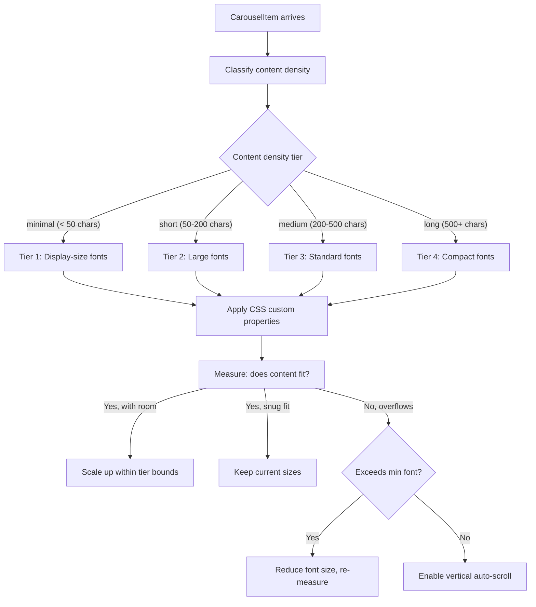

# Intelligent Content Area Scaling

## Problem

The current `ContentCarousel` uses a single, generic `transform: scale()` approach that treats all content identically. It measures the natural (CSS-clamp-sized) content and scales it to fit the container. This works acceptably for long content (Ayatul Kursi, lengthy hadiths) but **wastes significant space on short content** (a one-line announcement, a single Asma al-Husna name, a short verse). The text remains at its base CSS clamp size and the surplus area is empty whitespace.

The screenshot shows Al-Faatiha (1:1) — a very short verse — rendered at the same small base font size as a multi-paragraph hadith, leaving most of the content area unused.

## Root Cause

1. **Fixed CSS clamp typography** — `.text-carousel-title` is `clamp(1rem, 1.5rem, 1.9rem)`, `.text-carousel-body` is `clamp(0.85rem, 1.05rem, 1.25rem)`. These sizes are tuned for the *longest* expected content. Short content stays at these small sizes.
2. **Conservative scale-up cap** — When `scaleToFit >= 1` (content is smaller than container), the code caps at `min(scaleToFit * 0.84, 1)`, meaning it **never actually scales up** — scale is always <= 1.0. This is the main bug.
3. **No content-type awareness** — All types (verse, dua, announcement, asma al-husna) use the same base font sizes and the same scaling constants.

## Proposed Solution: Content-Aware Adaptive Typography

Instead of relying solely on `transform: scale()` (which scales everything uniformly including badge, spacing, and line-height), the new system will **dynamically compute font sizes** based on:

1. **Content type** — different types have different visual hierarchies
2. **Content length** (character count / word count) — the primary driver of font size
3. **Available container dimensions** — measured via ResizeObserver
4. **A binary fit-check loop** — iteratively adjust font size to maximise fill without overflow

### Architecture




### Key Design Decisions

**1. CSS Custom Properties over `transform: scale()`**

Rather than scaling the entire content div with a CSS transform (which scales padding, gaps, badges equally — making badges comically large on short content), we set CSS custom properties (`--title-size`, `--body-size`, `--arabic-size`) on the content wrapper. Each text element references these variables. This gives us independent control over text size vs layout spacing.

The existing `transform: scale()` approach is kept as a **fallback safety net** (clamped to 0.85-1.0 range) for edge cases, but the heavy lifting is done by font-size adjustment.

**2. Content Density Classification**

A utility function `classifyContentDensity(item: CarouselItem)` will compute a density score based on:

- Total character count across all text fields (title + body + arabic + transliteration + source)
- Content type (announcements tend to be short, duas can be long)
- Number of distinct text blocks (arabic + transliteration + translation = 3 blocks vs just body = 1 block)

This produces a tier (1-4) with base font size multipliers.

**3. Binary-Search Fit Loop**

After applying the tier's base sizes, a `requestAnimationFrame` loop checks if content fits. If there is significant headroom (content height < 70% of container height), sizes are increased. If content overflows, sizes are decreased. This converges in 3-5 iterations maximum (binary search on a multiplier between 0.6 and 2.5).

**4. Auto-Scroll for Extreme Overflow (Long Content)**

For content that still overflows at minimum readable font sizes (tier 4, multiplier at floor), a smooth vertical auto-scroll kicks in:

- Scroll speed: ~30px/s (slow enough to read from a distance)
- Pause at top for 3 seconds before scrolling
- Pause at bottom for 3 seconds before resetting
- CSS `overflow-y: hidden` with JS-driven `scrollTop` animation (no visible scrollbar)
- Only activates when content is genuinely too long — the vast majority of content will fit without scrolling

This is a **good idea** for edge cases (very long announcements, full Ayatul Kursi with multiple translations). It's better than truncation or unreadably small text. However, it should be a last resort — the font size adjustment should handle 90%+ of cases.

### Files to Change

**Primary:** [ContentCarousel.tsx](apps/display app/masjidconnect-display-app/src/components/display/ContentCarousel.tsx)

- Replace the current scaling `useEffect` with the new adaptive typography system
- Add CSS custom property application to the content wrapper
- Add auto-scroll logic for overflow cases

**New utility:** Create `contentScaling.ts` in the same directory

- `classifyContentDensity(item: CarouselItem): ContentDensityTier`
- `computeAdaptiveFontSizes(tier, containerW, containerH): FontSizeConfig`
- Tier definitions with base multipliers and min/max bounds
- Constants for all magic numbers

**CSS:** [index.css](apps/display app/masjidconnect-display-app/src/index.css)

- Update `.text-carousel-title`, `.text-carousel-body`, `.text-carousel-arabic` to reference CSS custom properties with their current values as fallbacks:

```css
  .text-carousel-title {
    font-size: var(--carousel-title-size, clamp(1rem, 1.5rem, 1.9rem));
  }
  

```

- Add auto-scroll animation keyframes

**No changes needed:** LandscapeLayout, PortraitLayout, DisplayScreen, Header, Footer — the content area dimensions remain the same; only the internal content sizing changes.

### Content Type Specific Behaviour


| Type                          | Typical Length        | Visual Priority                        | Scaling Strategy                                 |
| ----------------------------- | --------------------- | -------------------------------------- | ------------------------------------------------ |
| **Asma al-Husna**             | Minimal (~20 chars)   | Arabic largest, meaning secondary      | Tier 1 — display-size Arabic, large meaning text |
| **Short announcement**        | Short (~50-100 chars) | Body text dominant                     | Tier 1-2 — large body text fills the area        |
| **Verse (short surah)**       | Short-medium          | Arabic + translation                   | Tier 1-2 — both Arabic and translation scale up  |
| **Dua**                       | Medium-long           | Arabic + transliteration + translation | Tier 2-3 — balanced sizing across 3 blocks       |
| **Long hadith**               | Long (500+ chars)     | Body dominant                          | Tier 3-4 — standard to compact sizing            |
| **Ayatul Kursi / long verse** | Very long             | Arabic + translation                   | Tier 4 — compact with auto-scroll if needed      |


### Auto-Scroll Decision

**Recommendation: Yes, implement auto-scroll as a last-resort fallback.** Reasons:

- It's better than truncation (which loses content) or tiny text (which defeats the purpose of a display screen)
- Slow, smooth scrolling is readable from a distance and feels natural on a display
- It only activates for genuinely long content — most content will fit with the adaptive font sizing
- Similar display systems (airport information boards, digital signage) use this pattern successfully
- The scroll speed should be configurable (defaulting to ~30px/s) and pauses at top/bottom prevent content from feeling rushed

**Caveat:** Auto-scroll should NOT be used for Arabic text blocks alone — Arabic calligraphy should remain static and prominent. If a slide has both long Arabic and long translation, the Arabic stays at a readable size and only the translation section scrolls if needed.