# Display App Communication Flows - Visual Diagrams

This document contains visual flow diagrams for all major communication patterns between the Display App and the Backend.

---

## Table of Contents

1. [Device Pairing Flow](#device-pairing-flow)
2. [Initial Setup Flow](#initial-setup-flow)
3. [Normal Operation Flow](#normal-operation-flow)
4. [Emergency Alert Flow](#emergency-alert-flow)
5. [Remote Command Flow](#remote-command-flow)
6. [Content Update Flow](#content-update-flow)
7. [Prayer Times Update Flow](#prayer-times-update-flow)
8. [WebSocket Reconnection Flow](#websocket-reconnection-flow)
9. [Offline Detection Flow](#offline-detection-flow)
10. [Error Handling Flow](#error-handling-flow)

---

## Device Pairing Flow

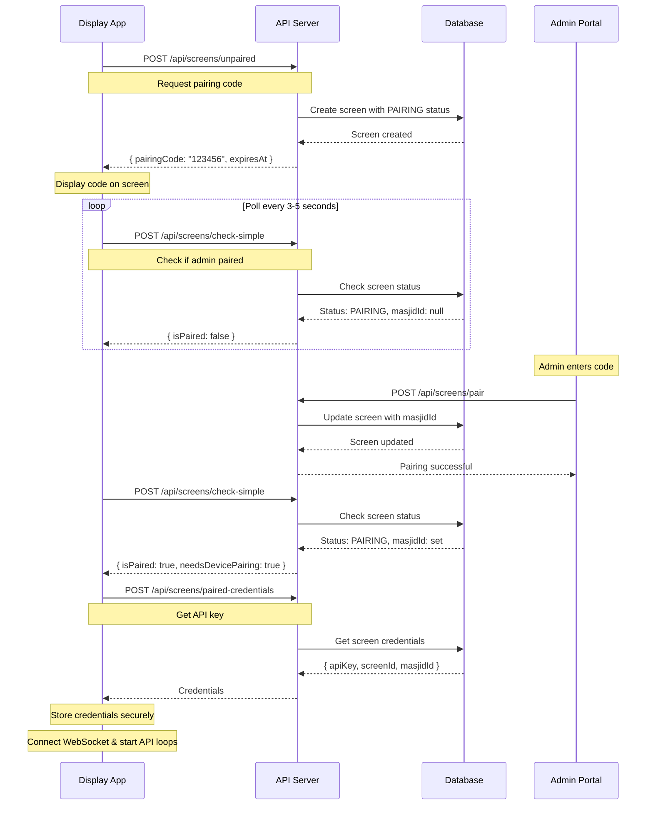

---

## Initial Setup Flow

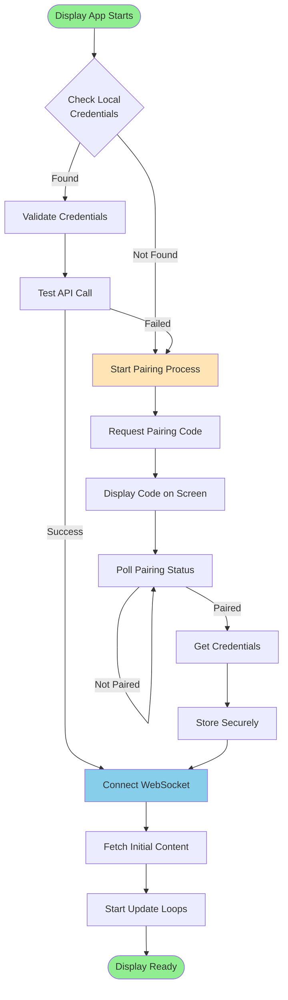

---

## Normal Operation Flow

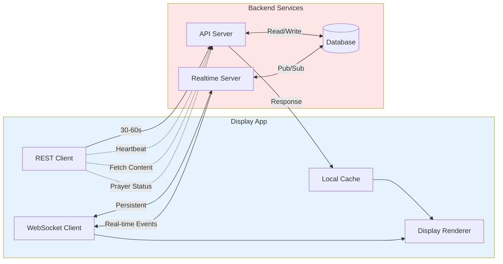

---

## Emergency Alert Flow

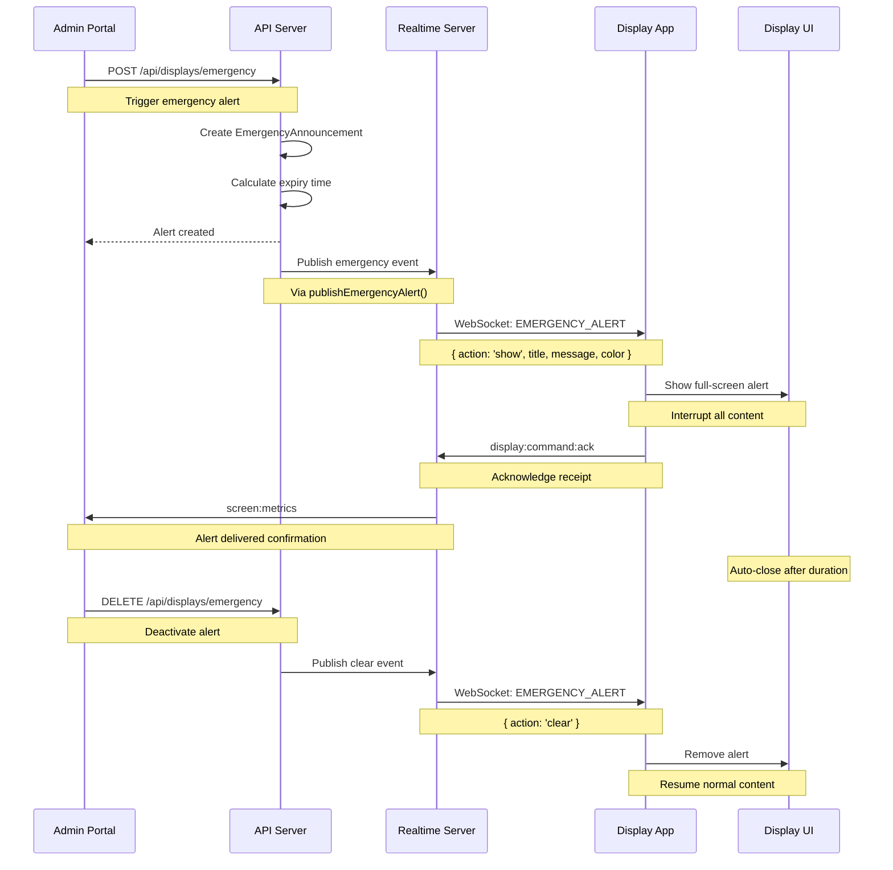

---

## Remote Command Flow

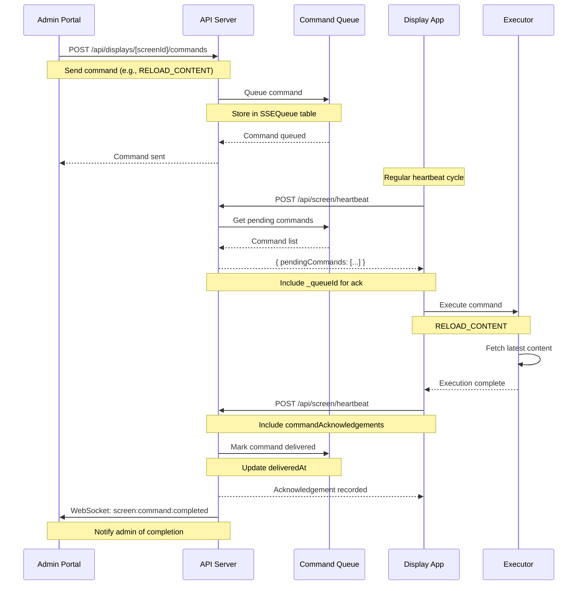

---

## Content Update Flow

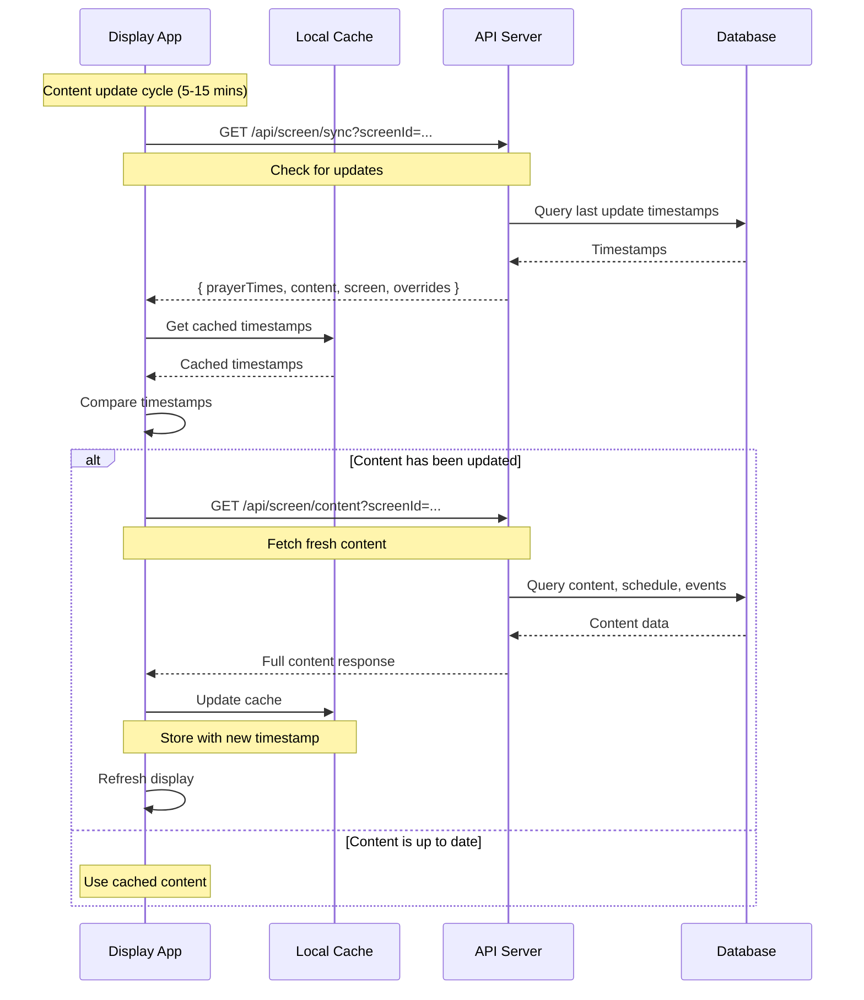

---

## Prayer Times Update Flow

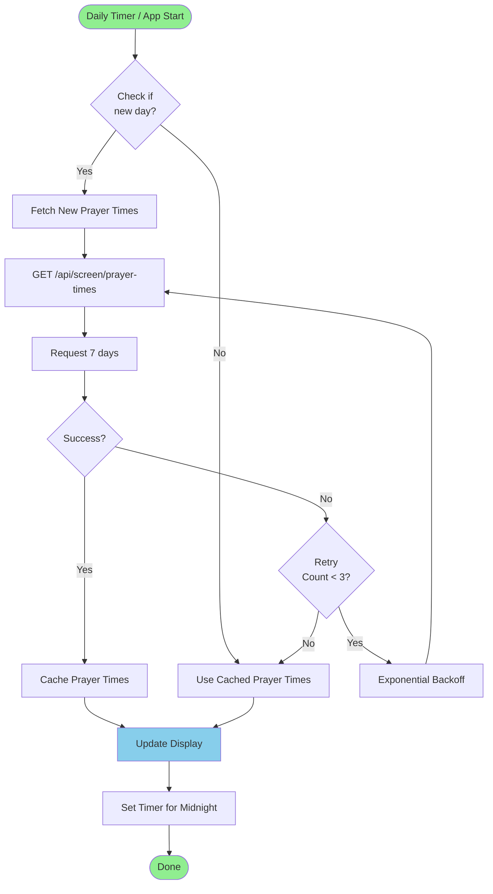

---

## WebSocket Reconnection Flow

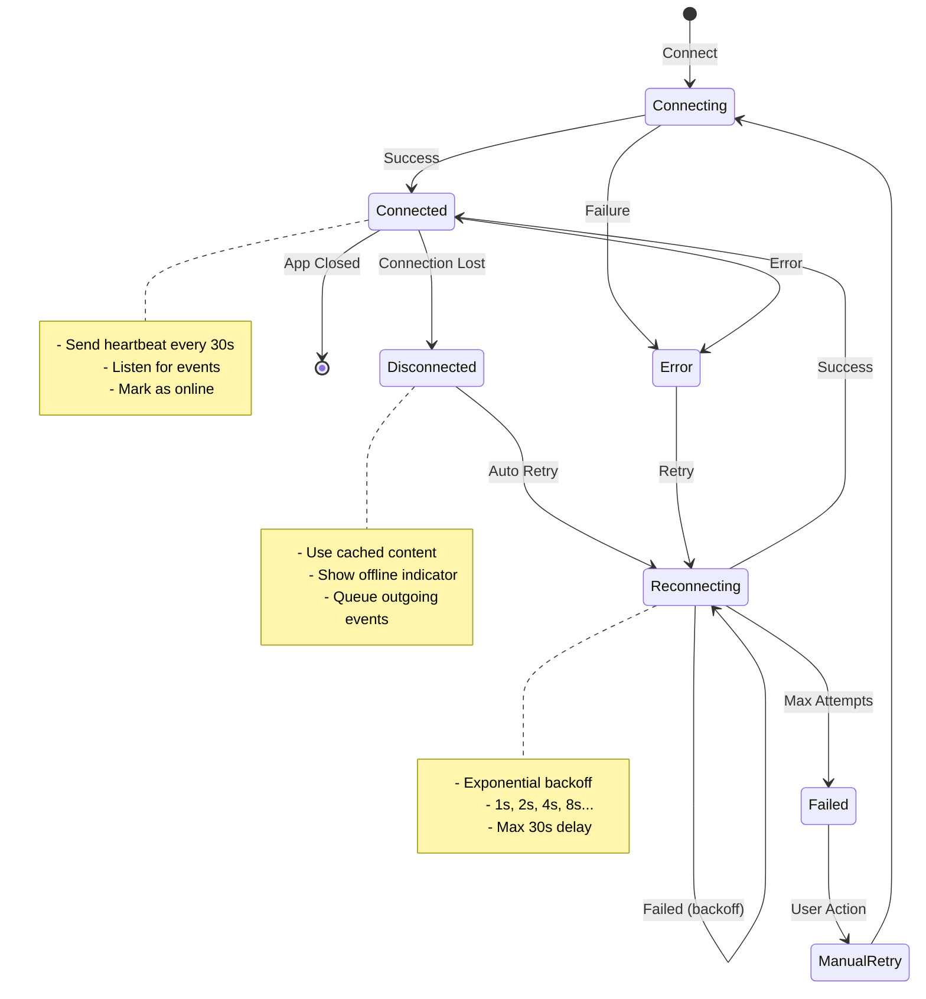

---

## Offline Detection Flow

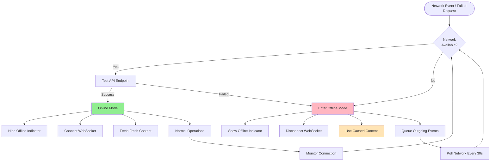

---

## Error Handling Flow

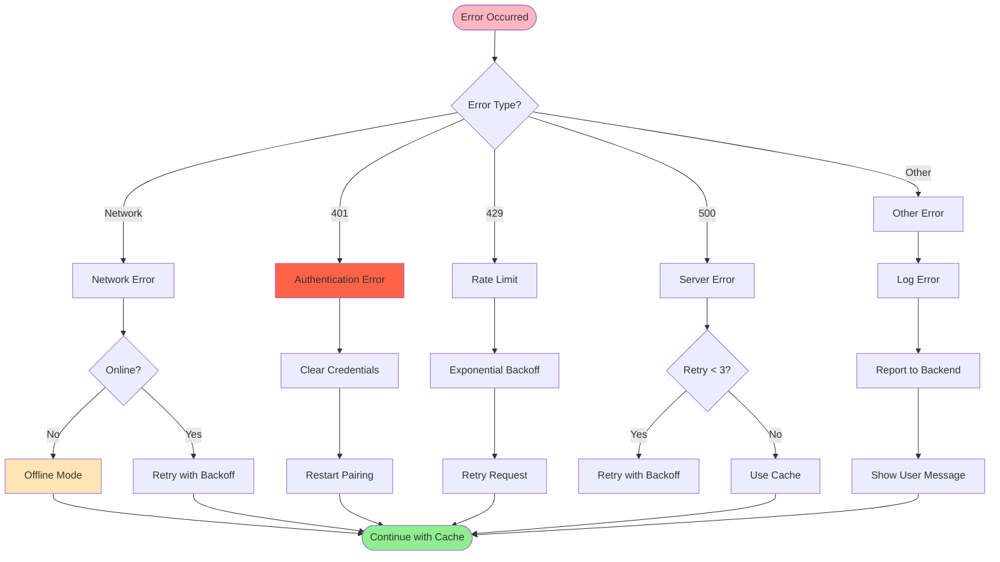

---

## Heartbeat Cycle

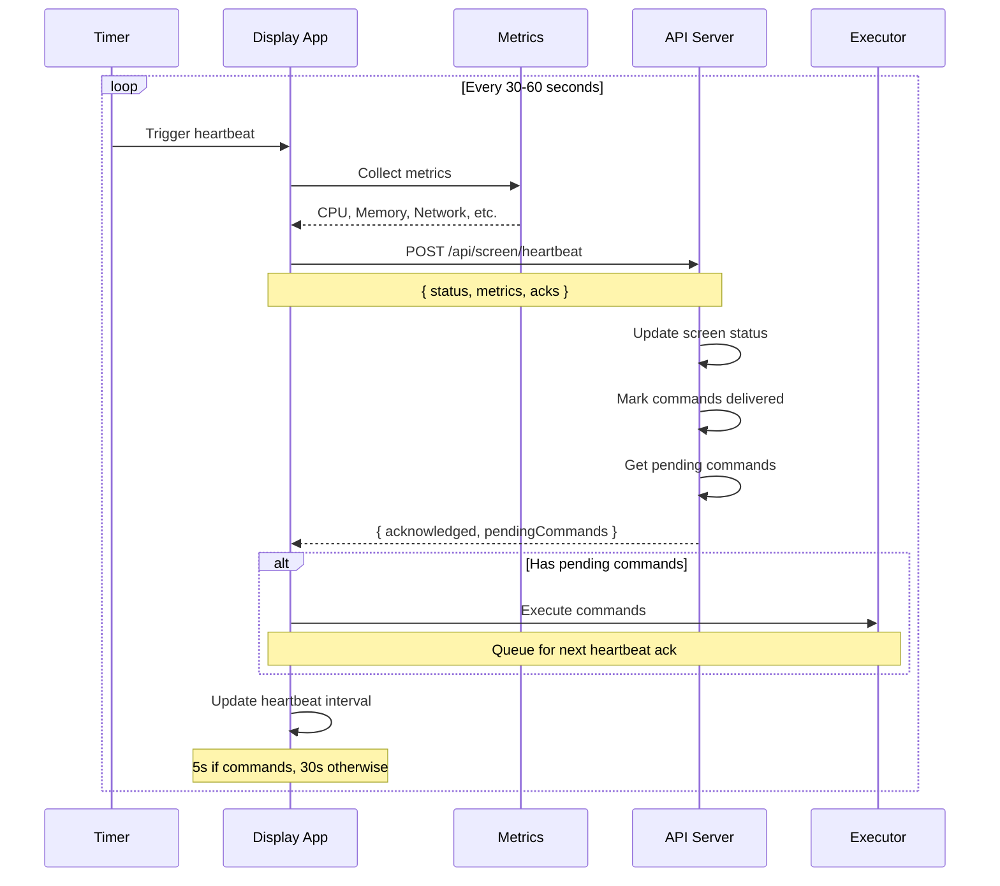

---

## Prayer Status Update Cycle

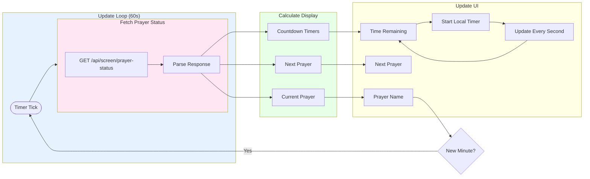

---

## Content Rotation Cycle

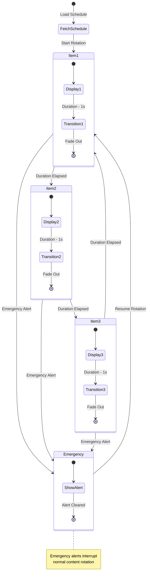

---

## Complete System Architecture

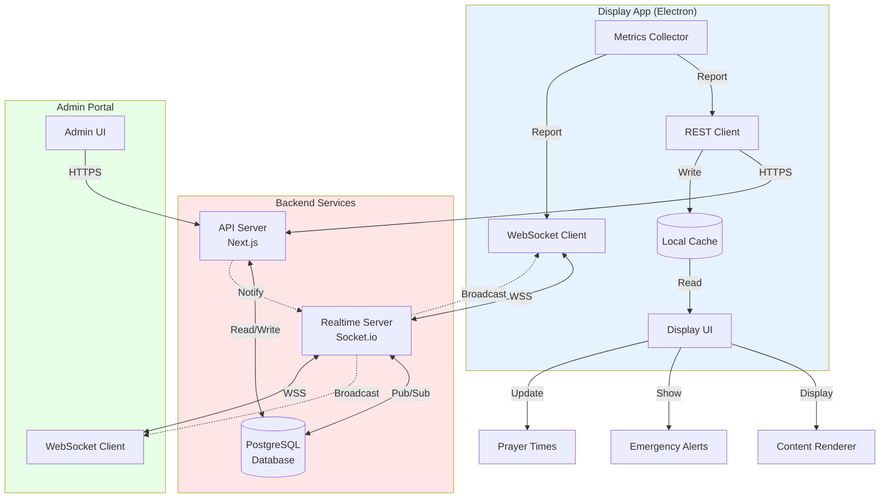

---

## Summary

These flow diagrams provide a visual representation of how the Display App communicates with the backend. Key takeaways:

1. **Two channels**: REST API for data, WebSocket for real-time events
2. **Resilient**: Automatic reconnection, offline mode, caching
3. **Efficient**: Smart polling, sync checks, exponential backoff
4. **Secure**: Encrypted credentials, authentication at all levels
5. **Real-time**: Emergency alerts and commands delivered instantly

For detailed implementation instructions, see the main documentation:
- [DISPLAY-BACKEND-COMMUNICATION.md](./DISPLAY-BACKEND-COMMUNICATION.md)
- [QUICK-REFERENCE.md](./QUICK-REFERENCE.md)

**Last Updated:** 26 December 2025

